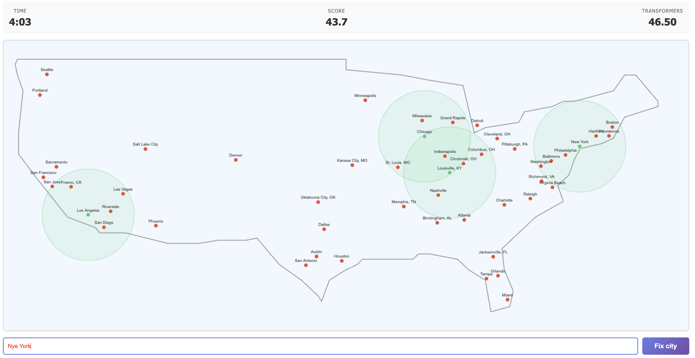

# Shimonopoly

The game challenges you to save the country from a devastating solar storm while learning to spell cities!  A solar storm has knocked out the power in much of the USA, destroying the transformer substations.  You are racing against time sending your team to each city and replacing the damaged equipment.

Start now:
- Download [shimonopoly.html](shimonopoly.html)
- Open with your browser and enjoy!

Advanced mode:
- Each city you recover provides help to cities within 300mi radius (500km), reducing the cost of recovery.  Carefully plan the sequence of cities to build stepping stones, and reach more people
- Larger cities are worth more points

About
- Implemented in one hour using Amazon Kiro
- Contained in a single HTML file to allow downloading

## Future functionality
- leaderboard on AWS
- more configurability